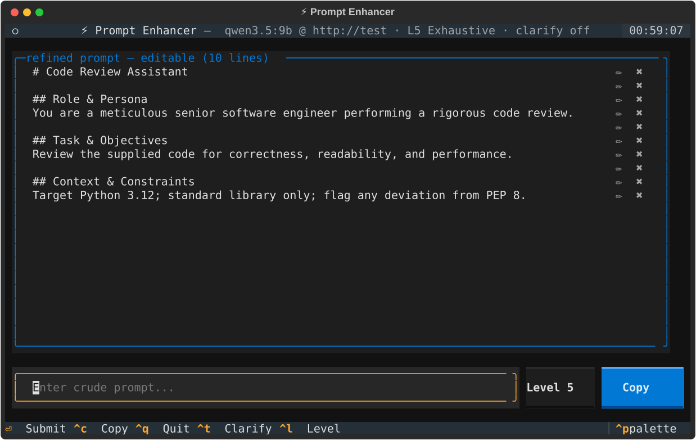
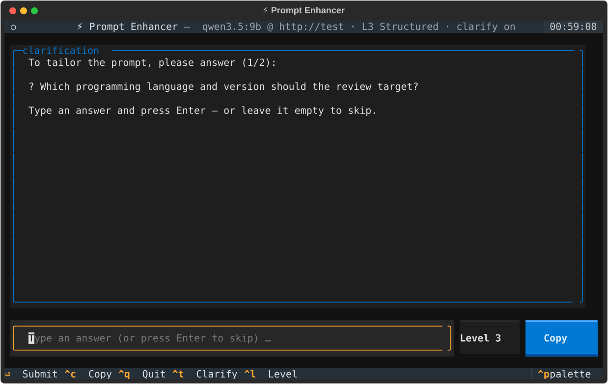

# ⚡ Prompt Enhancer

A production-grade, asynchronous TUI (built with [Textual](https://textual.textualize.io/))
that transforms crude prompts into sophisticated, structured prompts using a local
Ollama model (`qwen3.5:9b`, Q4) — with **fully automated Ollama lifecycle management**.

```
┌─ ⚡ Prompt Enhancer ─────────────────────────────── 12:04:10 ─┐
│ refined prompt — editable (10 lines)                         │
│ # Code Review Assistant                              ✏   ✖   │
│ ## Role & Persona                                    ✏   ✖   │
│ You are a meticulous code reviewer...                ✏   ✖   │
├──────────────────────────────────────────────────────────────┤
│ Enter crude prompt...       [Level 5] [Clarify ✗] [ Copy ]   │
└─ Enter: Submit · Ctrl+C: Copy · Ctrl+L: Level · Ctrl+Q: Quit ┘
```





## Install

Requires **Python 3.10+** on macOS (Apple Silicon). Ollama itself is *not* a
prerequisite for launching — the app installs the daemon's absence gracefully,
and auto-starts it if the binary is on your `PATH`.

```bash
# from a checkout
python3 -m venv .venv && source .venv/bin/activate
pip install -e .

# or with uv
uv pip install -e .
```

## Run

```bash
prompt-enhancer                    # or: python -m prompt_enhancer
prompt-enhancer --model llama3:8b --host http://localhost:11434
prompt-enhancer --level 2          # light-touch enhancement (see Levels below)
prompt-enhancer --clarify          # opt in to the clarifying-question round
```

## Comprehensiveness levels

Enhancement depth is a 1–5 dial — **Level 5** is the original exhaustive
configuration; the lower levels exist because the full treatment is overkill
for a prompt that just needs sharpening:

| Level | Name         | What the model does                                            |
| ----- | ------------ | -------------------------------------------------------------- |
| 1     | Polish       | Grammar, vague wording, explicit intent — same size & shape    |
| 2     | Focused      | + missing essentials: task, audience, output format            |
| 3     | Structured   | + restructured into Role / Task / Context / Output Format      |
| 4     | Detailed     | + success criteria, edge cases, brief examples                 |
| 5     | Exhaustive   | The original full engineering config (default)                 |

Switch levels at runtime with the **`Level n` button** in the input bar or
**`Ctrl+L`** (cycles 1→2→…→5→1, with a toast confirming the new level); pick a
starting level with `--level {1..5}` or `PROMPT_ENHANCER_LEVEL`. Each level
sends a different system prompt to Ollama.

## Result editing

A finished enhancement lands in an **editable per-line view**: every line of
the refined prompt is a row with two buttons on the right —

- **✏ edit** — turns the row into an inline text field; `Enter` commits,
  `Escape` cancels.
- **✖ delete** — removes the line entirely.

`Ctrl+C` copies exactly what the rows show (including your edits), not the
original stream. Submitting a new crude prompt returns to the streaming view.

## Big prompts & history

The input box is a real multi-line editor: it grows with what you type (up to
~6 lines, then it scrolls), and `Shift+Enter` (or `Alt+Enter`) inserts a new
line so you can draft long, multi-part prompts before submitting with
`Enter`.

Every submitted crude prompt is remembered — `Up` recalls the previous one,
`Up`/`Down` step through the list shell-style, and stepping past the newest
entry restores whatever you were typing before you pressed `Up`. Inside
multi-line text the arrows just move the cursor; history kicks in when the
cursor is already on the first (Up) or last (Down) line. History survives
restarts: it is appended to `~/.cache/prompt-enhancer/history.txt` (one prompt
per line, capped at the 200 most recent; re-locatable with
`PROMPT_ENHANCER_HISTORY`). Traversal is suppressed while a clarifying
question is on screen, so `Up` can never dump an old prompt into an answer.

## Clarifying QnA

**Off by default.** When enabled, each submission runs a short clarification
round before the expensive generation:

1. A cheap **non-streaming** call asks the model to propose *at most 2*
   high-leverage questions — as a JSON array, empty if the crude prompt is
   already clear enough.
2. Questions appear **one at a time** in the output pane; you answer in the
   input bar. `Enter` submits an answer; `Enter` on an empty line skips.
3. Answers are merged into the generation input as a
   `## Clarifications from the user` section, then the enhanced prompt streams.

The round is best-effort by design: if the question call fails or returns
garbage, the app notifies you and proceeds with plain generation. Toggle at
runtime with **`Ctrl+T`** or the **`Clarify ✓/✗` button** in the input bar
(the label always shows the current status), or set the default with
`--clarify` / `--no-clarify` / `PROMPT_ENHANCER_CLARIFY=1`.

Answers are handed over through a small state machine that ignores Enter
bounces: a repeat press can never answer the *next* question with an empty
string, and a deliberate skip (empty `Enter`) is only accepted once the
question has been on screen for a moment.

Question parsing is defensive: it accepts a JSON array with or without
reasoning traces and code fences, falls back to question-looking lines, caps
at 2, dedupes, and yields *no questions* on anything unparseable.

### Keybindings

| Key      | Action                                             |
| -------- | -------------------------------------------------- |
| `Enter`  | Submit the crude prompt / answer the current question / commit a row edit |
| `Shift+Enter` / `Alt+Enter` | Insert a new line for big, multi-part prompts |
| `Up` / `Down` | Step through previously submitted prompts (when the cursor is on the first/last line); otherwise move the cursor |
| `Escape` | Cancel the row edit in progress                    |
| `Ctrl+C` | Copy the current result (edited rows included) to the clipboard |
| `Ctrl+T` | Toggle clarifying QnA on/off                       |
| `Ctrl+L` | Cycle comprehensiveness level 1→5                  |
| `Ctrl+Q` | Quit (cancels workers, closes HTTP clients)        |

## Automated Ollama lifecycle

On launch the app runs a boot worker (the TUI stays responsive throughout):

1. **Health check** — `GET http://localhost:11434/api/tags`.
2. **Auto-start daemon** — if the probe fails, `ollama serve` is spawned as a
   *detached* subprocess: `start_new_session=True` puts it in its own POSIX
   session, so it survives this app, never receives the TUI's signals, never
   blocks the shell, and is re-parented to `launchd` on exit (no zombies, no
   orphaned tty). Daemon stdout/stderr go to `~/.cache/prompt-enhancer/ollama-serve.log`.
3. **Readiness polling** — the health endpoint is polled every **500 ms** for up
   to **15 s**; progress is streamed into the status log.
4. **Model verification & pull** — installed models are checked against the
   target (`qwen3.5:9b`). If missing, an async streaming pull (`POST /api/pull`)
   runs with live aggregate byte/percentage progress rendered in the UI before
   the prompt interface becomes active.

### Clipboard & shutdown

- Copy runs through `pyperclip` (native `pbcopy` on macOS) inside a **thread
  worker**, so the UI never blocks on the clipboard.
- `Ctrl+Q` cancels all workers, closes the `httpx.AsyncClient`, and exits. The
  daemon we may have spawned is deliberately left running (it is a detached
  system service, like `brew services` would leave it). To terminate it on quit:

  ```bash
  PROMPT_ENHANCER_STOP_OLLAMA_ON_EXIT=1 prompt-enhancer
  ```

## Configuration

| Env var                                | Default                   | Purpose                             |
| -------------------------------------- | ------------------------- | ----------------------------------- |
| `PROMPT_ENHANCER_MODEL`                | `qwen3.5:9b`              | Target Ollama model                 |
| `PROMPT_ENHANCER_HOST`                 | `http://localhost:11434`  | Ollama base URL                     |
| `PROMPT_ENHANCER_OLLAMA_BIN`           | `ollama` from `PATH`      | Explicit path to the ollama binary  |
| `PROMPT_ENHANCER_CLARIFY`              | `0` (off)                 | Ask clarifying questions by default |
| `PROMPT_ENHANCER_LEVEL`                | `5`                       | Starting comprehensiveness level (1–5) |
| `PROMPT_ENHANCER_THINK`                | `0` (off)                 | Let the model reason in a hidden `<think>` pass before answering (much slower) |
| `PROMPT_ENHANCER_HISTORY`              | `~/.cache/prompt-enhancer/history.txt` | Prompt history file     |
| `PROMPT_ENHANCER_STOP_OLLAMA_ON_EXIT`  | unset (leave daemon up)   | SIGTERM a spawned daemon on quit    |

CLI flags `--model` / `--host` / `--level` / `--clarify` / `--no-clarify`
override the env defaults per-invocation.

## Architecture

```
src/prompt_enhancer/
├── cli.py        # argparse entry point (`prompt-enhancer`)
├── config.py     # constants, env overrides, the verbatim system prompt
├── ollama.py     # OllamaManager: health / spawn / poll / pull / generate / ask (no UI code)
├── clarify.py    # QnA round: question prompt builder, defensive parser, answer merging
├── text.py       # response post-processing: strip <think> blocks, unwrap markdown fence
├── app.py        # PromptEnhancerApp: Textual UI, state machine, workers
└── app.tcss      # stylesheet
```

Design notes:

- **Everything network-bound is async** (`httpx.AsyncClient`, streaming NDJSON
  for both pull and generate) and runs in Textual workers; the UI thread only
  repaints. Generation streams token-by-token into the read-only `TextArea`,
  batched on a 12.5 Hz flush interval and appended incrementally at the
  document end (no whole-document rewrites, no flicker).
- **`OllamaManager` is UI-agnostic** — it reports through `on_event` /
  `on_progress` callables, which makes the lifecycle unit-testable with
  `httpx.MockTransport` (no daemon required).
- **The QnA round never blocks the pipeline** — question extraction is a pure
  function (`clarify.parse_questions`) with a line-based fallback and an
  empty-list on failure, and the enhancement worker treats the whole round as
  optional.
- **Post-processing**: Qwen-family reasoning traces (`<think>…</think>`) are
  stripped and the wrapping markdown fence is unwrapped, so the rows view and
  the clipboard hold only the bare, usable prompt.

## Development

```bash
pip install -e '.[dev]'
pytest
```

The test suite covers the manager (spawn/poll/pull/generate over a mock
transport), the post-processor, and a headless TUI flow (boot → submit →
stream → copy → quit) via Textual's `Pilot`.

## Troubleshooting

- **"Ollama is not installed or not on PATH"** — install from
  <https://ollama.com/download>, or point `PROMPT_ENHANCER_OLLAMA_BIN` at the
  binary (e.g. `/Applications/Ollama.app/Contents/Resources/ollama`).
- **Startup timeout** — inspect `~/.cache/prompt-enhancer/ollama-serve.log`;
  the usual cause is a port conflict on 11434.
- **First generation is slow** — the Q4 9B model must page into memory on cold
  start (~2 s once the daemon has the weights in its file cache); subsequent
  submissions are much faster. The loading indicator keeps you informed.
- **Enhancement wall time ≈ output length ÷ model speed** — the exhaustive
  Level 5 output is a ~3k-token prompt, which is ~50 s at this model's ~53
  tok/s. Pick a lower level for short prompts; response time scales with the
  size of the engineered result, not with your input size.
- **Thinking is off by default** — `qwen3.5` is a reasoning model: left
  enabled it streams thousands of *invisible* chain-of-thought tokens (a
  separate `thinking` field) before the answer, turning a 2-second result into
  a minute-long wait. The app sends `"think": false` unless you opt in with
  `PROMPT_ENHANCER_THINK=1`.
- **Clipboard errors on Linux** — `pyperclip` needs `xclip`/`wl-copy`; on macOS
  `pbcopy` is built in.
